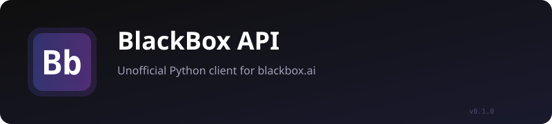

<p align="center">
  
</p>

<p align="center">
  
  
  
  
  
</p>

<p align="center">
  <a href="#quick-start">Quick Start</a> •
  <a href="#at-a-glance">At a Glance</a> •
  <a href="#examples">Examples</a> •
  <a href="#cli">CLI</a>
</p>

---

<p align="center">
  <strong>Unofficial Python client for blackbox.ai</strong>
  <br>
  No API key required — paste your browser cookies and go.
  <br>
  Or use an API key for the full OpenAI-compatible interface.
</p>

---

## Quick Start

```bash
pip install httpx curl-cffi
pip install -e .
```

**Cookies from browser (no API key):**

```python
from blackbox import WebChat

# Paste cookies from app.blackbox.ai DevTools → Network tab
cookies = "session=abc; next-auth.session-token=xyz; ..."
wc = WebChat(cookie_header=cookies, validated="your-uuid")

result = wc.chat("What is the capital of France?")
print(result.content)
```

**API key:**

```python
from blackbox import BlackBoxClient, ChatMessage

client = BlackBoxClient(api_key="sk-...")
result = client.chat_complete(
    messages=[ChatMessage(role="user", content="Hello!")],
    model="anthropic/claude-sonnet-4.5",
)
print(result.content)
```

**Automated login (gets cookies for you):**

```python
from blackbox import WebChat

wc = WebChat.login(email="user@example.com", password="...")
result = wc.chat("Hello after login")
```

## At a Glance

| Area | Methods | Auth |
|------|---------|------|
| Chat | `web_chat`, `web_chat_stream` | cookie |
| Search | `web_search`, `web_search_stream` | cookie |
| Code | `web_generate_code` | cookie |
| Image | `web_generate_image` | cookie |
| Video | `web_generate_video` | cookie |
| Files | `chat_with_file`, `FileContentPart` | cookie |
| Login | `WebChat.login` | email/password |
| API Chat | `chat_complete`, `chat_complete_stream` | API key |
| API Image | `generate_image` (Flux, Ideogram) | API key |
| API Video | `generate_video` (Veo-2, Ray-2) | API key |
| Tools | function calling, tool_choice, reasoning | API key |
| Agents | CRUD + execute single agents | API key |
| Multi-Agent | parallel task orchestration | API key |
| Account | session info, credits, models | API key |

## Examples

```python
# Web chat with browser cookies
from blackbox import WebChat

wc = WebChat(cookie_header="session=abc; ...", validated="a38f5889-...")
result = wc.chat("Explain quantum computing")
print(result.content)

# Search with sources
result = wc.search("Python 3.14 new features")
for s in result.sources:
    print(f"  {s['title']}: {s['url']}")

# Streaming
for chunk in wc.chat_stream("Write a poem"):
    print(chunk, end="")

# File chat
result = wc.chat_with_file("report.pdf", "Summarize this")

# API key usage
from blackbox import BlackBoxClient, Tool, ReasoningConfig

client = BlackBoxClient(api_key="sk-...")
tools = [Tool(type="function", function={
    "name": "get_weather",
    "description": "Get weather for a city",
    "parameters": {
        "type": "object",
        "properties": {"location": {"type": "string"}},
        "required": ["location"],
    },
})]
result = client.chat_complete(
    messages=[ChatMessage(role="user", content="Weather in Paris?")],
    model="google/gemini-2.0-flash-001",
    tools=tools,
    reasoning=ReasoningConfig(effort="medium"),
)

# Image generation (API key)
img = client.generate_image("a cat in space", model="flux-pro")
print(img.data[0].url)

# Multi-agent task (API key)
from blackbox import AgentTaskConfig
task = client.create_multi_agent_task(
    prompt="Add README in Spanish",
    agents=[
        AgentTaskConfig(agent="claude", model="anthropic/claude-sonnet-4.5"),
        AgentTaskConfig(agent="blackbox", model="blackbox-pro"),
    ],
)
```

## CLI

```bash
# Cookies (no API key)
python -m blackbox webchat "Hello!"
python -m blackbox websearch "AI news"
python -m blackbox webcode "quicksort in python"
python -m blackbox login --email user@example.com

# API key
python -m blackbox --api-key "sk-..." chat "Hello"
python -m blackbox --api-key "sk-..." search "latest AI news"
python -m blackbox --api-key "sk-..." image "a cat"
python -m blackbox --api-key "sk-..." video "drone shot"
```

## Docs

| | |
|---|---|
|  [Web Chat](src/blackbox/webchat.py) | Browser-session chat, SSE streaming, all mode flags |
|  [Web Auth / Login](src/blackbox/login.py) | NextAuth flow — action hash, RSC parsing, session extraction |
|  [File Upload](src/blackbox/files.py) | Base64 file encoding, MIME detection, chat-with-file |
|  [Chat Completions](src/blackbox/chat.py) | Full OpenAI-compatible API, all 30+ params, tool calling |
|  [Agent API](src/blackbox/agents.py) | Single-agent CRUD + multi-agent task orchestration |
|  [Models & Pricing](src/blackbox/models.py) | Data classes, constants, MODEL_PRICING table |

## Project

```
src/blackbox/
├── __init__.py    # Public API exports
├── __main__.py    # python -m blackbox
├── cli.py         # CLI entry point
├── client.py      # BlackBoxClient — API key interface
├── webchat.py     # Web endpoint — cookie auth
├── login.py       # NextAuth login (curl_cffi)
├── files.py       # File upload utilities
├── chat.py        # API chat completions (httpx)
├── auth.py        # Web authentication helpers
├── image.py       # Image generation
├── code.py        # Code generation
├── credits.py     # Credit balance
├── agents.py      # Single + Multi-agent APIs
└── models.py      # Data classes + pricing constants
```

## License

MIT &copy; [etrnkz](https://github.com/etrnkz/black-box-unoffcial-api)
